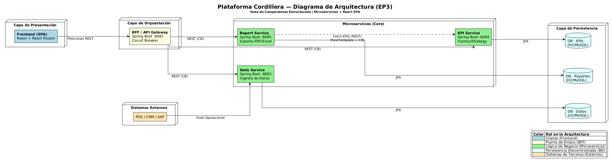
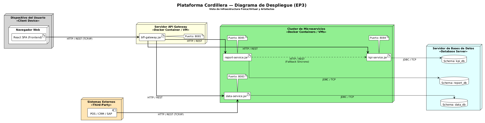

# Cordillera Platform — EP3 Integración y Testing

## 1. Información del proyecto

| Campo | Detalle |
| --- | --- |
| Proyecto | Cordillera Platform |
| Empresa caso | Grupo Cordillera |
| Asignatura | Desarrollo Full Stack III — DSY1106 |
| Sección | 001D |
| Institución | Duoc UC |
| Tipo de entrega | Parcial 3 — EP3 Integración + Testing |
| Tipo de trabajo | Grupal |
| Arquitectura | Microservicios con orquestador BFF (Backend for Frontend) |
| Persistencia | Patrón Database per Service (MySQL) |
| Stack Tecnológico | React 19, Vite, Java, Spring Boot 4.0.6, Resilience4j, JaCoCo, Docker |

---

## 2. Integrantes del equipo

| Integrante | Componente(s) asignado(s) | Rol o responsabilidad principal |
| --- | --- | --- |
| **Ignacio Valeria** | Frontend, Report Service, Infraestructura | Desarrollo de la interfaz ejecutiva UX/UI en React, integración de rutas, implementación del Report Service utilizando Factory Pattern y orquestación de la infraestructura completa en Docker Compose. |
| **Benjamín Palma** | KPI Service, BFF Gateway, Testing | Desarrollo del motor de indicadores, orquestación centralizada en el BFF Gateway (incluyendo estrategias de Fallback y tolerancia a fallos), y aseguramiento de calidad mediante Pruebas Unitarias y cobertura con JaCoCo. |
| **Benjamín Flores** | Data Service, Persistencia (JPA) | Desarrollo del servicio operacional base (CRUD). Implementación del Diagrama ER, configuración de repositorios JPA y documentación oficial de la estrategia de persistencia del proyecto. |

---

## 3. Descripción general

**Cordillera Platform** es una solución tecnológica diseñada para el equipo directivo del **Grupo Cordillera**. Ante la necesidad de contar con información centralizada y en tiempo real para la toma de decisiones, se ha desarrollado un ecosistema basado en microservicios independientes.

El sistema abandona las arquitecturas monolíticas tradicionales para adoptar un enfoque distribuido, donde un **BFF (Backend for Frontend)** actúa como orquestador principal, consumiendo datos operacionales, indicadores de rendimiento (KPIs) y reportes gerenciales desde múltiples microservicios especializados.

La solución destaca por su alta cohesión, bajo acoplamiento, tolerancia a fallos mediante patrones de resiliencia, y una interfaz de usuario moderna y reactiva que consume el flujo consolidado de información.

---

## 4. Objetivo del proyecto

Desarrollar e integrar una plataforma full-stack distribuida que permita al Grupo Cordillera visualizar métricas de negocio. El objetivo principal es asegurar la correcta comunicación e integración entre el Frontend y los Microservicios a través de un BFF, demostrando además altos estándares de calidad de software mediante pruebas automatizadas y despliegue orquestado.

---

## 5. Arquitectura general

El sistema se compone de una aplicación Frontend, un orquestador BFF y tres microservicios de dominio.

### 5.1 Diagrama de arquitectura de microservicios



### 5.2 Diagrama de despliegue



---

## 6. Componentes del sistema

| Componente | Carpeta / Directorio | Base de datos asociada | Responsabilidad |
| --- | --- | --- | --- |
| **Frontend** | `frontend/` | No aplica | Interfaz ejecutiva en React 19 para la visualización de dashboard, KPIs y reportes. |
| **BFF Gateway** | `bff-gateway/` | No aplica | Punto único de entrada para el Frontend. Orquesta peticiones y consolida datos. |
| **Data Service** | `data-service/` | `data_db` | Gestión y CRUD de datos operacionales provenientes de múltiples orígenes. |
| **KPI Service** | `kpi-service/` | `kpi_db` | Cálculo dinámico de indicadores ejecutivos, utilizando el patrón Factory Method. |
| **Report Service** | `report-service/` | `report_db` | Generación de reportes gerenciales (formatos PDF, Excel, JSON). |

> **Nota sobre Tolerancia a Fallos:** La plataforma implementa respuestas Fallback manuales en el BFF Gateway y utiliza la librería **Resilience4j (Circuit Breaker)** en las comunicaciones internas profundas (como de KPI Service hacia Data Service) para evitar bloqueos en cascada.

---

## 7. Tecnologías utilizadas

| Categoría | Tecnología |
| --- | --- |
| Frontend | React 19, Vite, TailwindCSS (opcional), Nginx |
| Backend Core | Java, Spring Boot 4.0.6 |
| Gestión de dependencias | Maven (Wrapper `mvnw`) |
| Persistencia | JPA/Hibernate, MySQL 8.4 |
| Resiliencia | Resilience4j (Circuit Breaker) |
| Pruebas Unitarias | JUnit 5, Mockito, H2 in-memory |
| Calidad de Código | JaCoCo 0.8.13 (Quality Gate > 60%) |
| Contenedores | Docker, Docker Compose |
| Documentación API | Swagger UI, OpenAPI 3.0 |

---

## 8. Requisitos previos

Antes de levantar el proyecto, es estrictamente necesario contar con lo siguiente en la máquina anfitriona:

| Herramienta | Uso |
| --- | --- |
| Docker Desktop / Engine | Para orquestar y levantar los microservicios y el frontend. |
| XAMPP / MySQL local | Motor de base de datos relacional corriendo en el puerto 3306. |
| Git | Control de versiones para clonar el repositorio. |
| Postman | Para realizar pruebas directas a las APIs (opcional). |

---

## 9. Clonar repositorios (Arquitectura Polyrepo)

Para desplegar la arquitectura completa en tu entorno local, primero debes clonar este repositorio orquestador y luego, **dentro de su carpeta raíz**, clonar los 5 repositorios individuales que componen el proyecto. 

Copia y pega este bloque en tu terminal:

```powershell
# 1. Clonar el Orquestador/Infraestructura (donde estás ahora)
git clone https://github.com/Nachovn12/cordillera-platform-ep3.git
cd cordillera-platform-ep3

# 2. Clonar los Microservicios dentro de la raíz del orquestador
git clone https://github.com/Nachovn12/cordillera-frontend.git frontend
git clone https://github.com/Nachovn12/cordillera-bff-gateway.git bff-gateway
git clone https://github.com/Nachovn12/cordillera-data-service.git data-service
git clone https://github.com/Nachovn12/cordillera-kpi-service.git kpi-service
git clone https://github.com/Nachovn12/cordillera-report-service.git report-service
```

*Nota crucial: Al agregar los nombres de carpeta al final del comando git (ej. `frontend`, `bff-gateway`), garantizamos que las carpetas queden nombradas exactamente como las espera el archivo `docker-compose.yml` para compilar.*

---

## 10. Configuración de bases de datos MySQL

La arquitectura exige que cada microservicio maneje su propia base de datos (Database per Service). 
Los contenedores Docker del proyecto están configurados para conectarse a tu máquina local mediante el host especial `host.docker.internal:3306`.

Por lo tanto, **antes de levantar los contenedores**, debes:

1. Abrir **XAMPP Control Panel**.
2. Iniciar el servicio **MySQL** (Puerto 3306).
3. Abrir phpMyAdmin (o tu cliente SQL preferido).
4. No es necesario crear las bases de datos manualmente, ya que las cadenas de conexión en `docker-compose.yml` incluyen el parámetro `createDatabaseIfNotExist=true`. Sin embargo, si deseas crearlas, los nombres son:
   - `data_db`
   - `kpi_db`
   - `report_db`
   - `auth_db` (reservada para BFF si aplica)

---

## 11. Ejecución del sistema (Paso a Paso)

El despliegue de toda la plataforma está automatizado mediante Docker Compose. 

### Paso 1: Levantar la infraestructura
Abre una terminal en la raíz del proyecto (donde se ubica el archivo `docker-compose.yml`) y ejecuta:

```powershell
docker compose up --build -d
```
> **Nota:** Espera aproximadamente de 1 a 2 minutos. Los microservicios de Spring Boot deben inicializarse, crear las tablas mediante JPA y conectarse al MySQL de tu XAMPP. El BFF Gateway esperará automáticamente a que los demás servicios estén operativos (estado "Healthy") antes de activarse.

### Paso 2: Acceder a la Interfaz de Usuario
Una vez que la consola de Docker muestre los contenedores corriendo, abre tu navegador web en la siguiente dirección:

**URL (Modo Producción):** [http://localhost:8081](http://localhost:8081)
*(El BFF Gateway empaqueta y sirve el Frontend estático directamente, evitando problemas de CORS).*

**Credenciales de Acceso:**
Para probar la plataforma, utiliza los usuarios precargados en el Frontend:

| Rol | Usuario (Email) | Contraseña |
| --- | --- | --- |
| **Gerente General** | `a.gatica@cordillera.cl` | `gerencia2026` |
| **Administrador** | `admin.valdivia@cordillera.cl` | `admin123` |

---

## 12. Validación de Pruebas Unitarias (JaCoCo)

La rúbrica exige demostrar un mínimo de **60% de cobertura** en ramas e instrucciones. Para ejecutar las pruebas y validar el Quality Gate, debes usar el Maven Wrapper (`mvnw.cmd`) incluido en el proyecto, abriendo una terminal por cada servicio:

**1. BFF Gateway:**
```powershell
cd .\bff-gateway\
.\mvnw.cmd clean verify
cd ..
```

**2. Data Service:**
```powershell
cd .\data-service\
.\mvnw.cmd clean verify
cd ..
```

**3. KPI Service:**
```powershell
cd .\kpi-service\
.\mvnw.cmd clean verify
cd ..
```

**4. Report Service:**
```powershell
cd .\report-service\
.\mvnw.cmd clean verify
cd ..
```

*Si la cobertura es mayor al 60%, el resultado en la consola será `BUILD SUCCESS` para cada módulo.*

**Ver los Reportes Gráficos (HTML):**
JaCoCo genera automáticamente un reporte gráfico navegable. Puedes abrir el archivo `index.html` generado en tu navegador buscando en las siguientes rutas relativas:
- `bff-gateway/target/site/jacoco/index.html`
- `data-service/target/site/jacoco/index.html`
- `kpi-service/target/site/jacoco/index.html`
- `report-service/target/site/jacoco/index.html`

---

## 13. Swagger UI y Colección Postman

Todos los microservicios exponen su documentación técnica interactiva vía Swagger UI (accesibles una vez levantados los contenedores):

- **BFF Gateway (Punto Central):** [http://localhost:8081/swagger-ui.html](http://localhost:8081/swagger-ui.html)
- **Data Service:** [http://localhost:8083/swagger-ui.html](http://localhost:8083/swagger-ui.html)
- **KPI Service:** [http://localhost:8084/swagger-ui.html](http://localhost:8084/swagger-ui.html)
- **Report Service:** [http://localhost:8085/swagger-ui.html](http://localhost:8085/swagger-ui.html)

**Colección Postman:**
La colección oficial unificada para realizar pruebas directas a las APIs se encuentra almacenada en el repositorio:
- `api-rest/coleccion-postman.json`

---

## 14. Documentación Entregable EP3

En la carpeta raíz y el directorio `docs/` se encuentran todos los documentos exigidos por la rúbrica de la Evaluación Parcial 3:

1. `docs/diagramas/01-arquitectura-ep3.png`: Arquitectura de microservicios con dependencias.
2. `docs/diagramas/02-despliegue-ep3.png`: Diagrama de infraestructura y contenedores.
3. `docs/descripcion-persistencia.pdf`: Diseño relacional y modelo ER.
4. `docs/informe-pruebas-unitarias.pdf`: Evidencia consolidada de cobertura Jacoco (>60%) y testing.
5. `repositorios.txt`: Enlaces a los repositorios utilizados para revisión del código.

---

## 15. Conclusión

Cordillera Platform cumple con los más altos estándares de desarrollo distribuido al separar responsabilidades, unificar las respuestas a través de un BFF, implementar tolerancia a fallos, dockerizar la solución completa e incorporar una interfaz gráfica moderna. Todo el código base se encuentra debidamente respaldado por pruebas unitarias, garantizando la mantenibilidad y evolución del proyecto.
